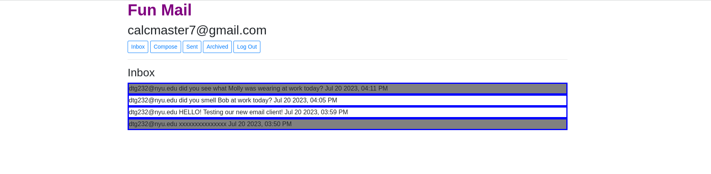

# fun_mail
This is my second to last project for the Harvard Web Development Class CS50web.  Some starter code was provided to me including the entire django backend. 

The interesting part of this application is the inbox.js file. A front-end for an email client that makes API calls to send and receive emails. This is a single page application that uses client side javascript code to fetch different content dynamically from a backend django server

This is a single page application. Meaning there is one page of javascript that does all the magic.  Since the javascript file in question is nested within a few folders in the larger django app, I will paste it again below. So basically this javascript is making API calls to the Django web app which is communicating with a sqlite database to store the emails and user information.

document.addEventListener('DOMContentLoaded', function() {

  // Use buttons to toggle between views
    console.log('hello asshole')
    document.querySelector('#inbox').addEventListener('click', () => load_mailbox('inbox'));
    document.querySelector('#sent').addEventListener('click', () => load_mailbox('sent'));
    document.querySelector('#archived').addEventListener('click', () => load_mailbox('archive'));
    document.querySelector('#compose').addEventListener('click', () => compose_email(null));

    // By default, load the inbox
    load_mailbox('inbox');
    });

function compose_email(replying_to_this_email) {

  // Show compose view and hide other views
    document.querySelector('#emails-view').style.display = 'none';
    document.querySelector('#compose-view').style.display = 'block';
    document.querySelector('#single-display-view').style.display = 'none';

    if (replying_to_this_email === null ) {
    // Clear out composition fields
        document.querySelector('#compose-recipients').value = '';
        document.querySelector('#compose-subject').value = '';
        document.querySelector('#compose-body').value = '';
    }
    else {   // if replying_to_this_email is not null 
        document.querySelector('#compose-recipients').value = replying_to_this_email.sender;
        document.querySelector('#compose-subject').value = `Re: ${replying_to_this_email.subject}`;
        document.querySelector('#compose-body').value = `On ${replying_to_this_email.timestamp} ${replying_to_this_email.sender} wrote: ${replying_to_this_email.body}`;
    }

        
    document.querySelector('#compose-form').onsubmit = function() {
     
        fetch('/emails', {
            method: 'POST',
            body: JSON.stringify({
                recipients: document.querySelector('#compose-recipients').value,
                subject: document.querySelector('#compose-subject').value,
                body: document.querySelector('#compose-body').value,
            })
        })
        .then(response => response.json())
        .then(result => {
            console.log(result);
            if (result.message ===  "Email sent successfully.") {
                load_mailbox('sent');
            }
        })
        .catch(error => {
            console.log('Error:',error);
            document.querySelector('#error-message').innerHTML = `Error: ${error.message}`;
        });

        return false; 
    }
} 

// THREE TYPES OF MAILBOXES>   INBOX, SENT, ARCHIVE 
function load_mailbox(mailbox) {
    
    // Show the mailbox and hide other views
    document.querySelector('#emails-view').style.display = 'block';
    document.querySelector('#compose-view').style.display = 'none';
    document.querySelector('#single-display-view').style.display = 'none';
    // Show the mailbox name
    document.querySelector('#emails-view').innerHTML = `<h3>${mailbox.charAt(0).toUpperCase() + mailbox.slice(1)}</h3>`;
    
    const colors = [ 'blue'  ];

    fetch(`/emails/${mailbox}`)
    .then(response => response.json())
    .then(emails => {
        emails.forEach((email,index) => {
        // Print email
        //EACH EMAIL nees to be rendered in its own box, a div with a border
                 //if email.unread if false, make div white. actually the reverse
                 let element = document.createElement('div');
                 element.innerHTML = `${email.sender} ${email.subject} ${email.timestamp}`//probably want to change the sender for the sent mailbox but keep this for now
                
                 element.style.border = `3px solid ${colors[index % colors.length]}`;
                 //element.style.marginBottom = '1px';
                
                 if (email.read){ // here i am trying to check if email.read is false, but since i am new to javascript not sure if this is correct
                     element.style.background = 'grey' 
                 }else {
                     element.style.background = 'white'
                 }

                 element.addEventListener('click', function() {
                     console.log('This element has been clicked!')

                     // once the email has been clicked on, we will set the read field to true. But first, I want to check if read is already true
                     // because if read is already true, we can do nothing and avoid an uncesary fetch 
                     if (!email.read) {
                         fetch(`/emails/${email.id}`, {
                             method: 'PUT',
                             body: JSON.stringify({
                                 read: true
                             })
                         })
                     }
                     //the following line will display this new display view, because we only want to see a single email now
                     document.querySelector('#single-display-view').style.display = 'block';
                     //the following line will hide the emails view for us, because once an email gets clicked on, we no longer want to see a list
                     document.querySelector('#emails-view').style.display = 'none';
                     // so in here we probably want to trigger the display view, send a div to populate it
                     // so we need to fetch the email from the server
                     let displayView = document.querySelector('#single-display-view');
                     displayView.innerHTML = '';
                     fetch(`/emails/${email.id}`)
                         .then(response => response.json())
                         .then(email => {
                             // Print email

                             // and now we want to display this single email using the single-display-view
                             displayView.innerHTML = `
                                 

                                    
<strong>From:</strong> ${email.sender}

                                    
<strong>To:</strong> ${email.recipients}

                                    
<strong>Subject:</strong> ${email.subject}

                                    
<strong>Timestamp:</strong> ${email.timestamp}

                                    
<strong>Body:</strong>

                                    
${email.body}

                                 
`;
                             // Create the buttons and append them
                             if (mailbox === 'inbox' || mailbox === 'archive') {
                                 const replyButton = document.createElement('button');
                                 replyButton.textContent = 'Reply';
                                 replyButton.classList.add('reply');

                                 replyButton.addEventListener('click', () => {
                                     console.log('The reply button was clicked!');
                                     compose_email(email);
                                 });

                                 displayView.appendChild(replyButton);
                             }

                             if (mailbox === 'inbox') {
                                 const archiveButton = document.createElement('button');
                                 archiveButton.textContent = 'Archive';
                                 archiveButton.classList.add('archive');

                                 archiveButton.addEventListener('click', () => {
                                     console.log('The archive button was clicked!');
                                     // Add your fetch function here
                                     fetch(`/emails/${email.id}`, {
                                         method: 'PUT',
                                         body: JSON.stringify({
                                             archived: true
                                         })
                                     })
                                     .then(() => load_mailbox('inbox'));
                                 });

                                 displayView.appendChild(archiveButton);
                             }

                             if (mailbox === 'archive') {
                                 const unarchiveButton = document.createElement('button');
                                 unarchiveButton.textContent = 'Unarchive';
                                 unarchiveButton.classList.add('unarchive');

                                 unarchiveButton.addEventListener('click', () => {
                                     console.log('The unarchive button was clicked!');
                                     // Add your fetch function here
                                     fetch(`/emails/${email.id}`, {
                                         method: 'PUT',
                                         body: JSON.stringify({
                                             archived: false
                                         })
                                     })
                                     .then(() => load_mailbox('inbox')); 
                                 });

                                 displayView.appendChild(unarchiveButton);
                             }

                          
                    });

                });
            document.querySelector('#emails-view').appendChild(element);
            });
                
});
           
}
